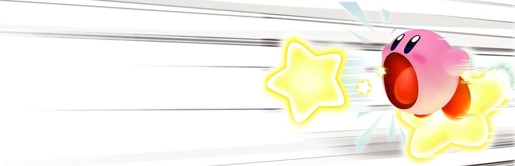

<h1 align="center">Hii, eu sou a Emilia! </h1> 
 Desenvolvedora Front-end & UI/UX Designer em início de jornada ✨  Aprendendo, criando e me divertindo com cada linha de código 💻💕 

Aqui eu falo um pouco sobre o meu constante aprendizado com front-end e o equilibrio com designer unindo os dois dentro do meu universo. 
Amo transformar ideias em sites e apps bonitinhos e fáceis de usar, sempre priorizo autenticidade e identidade. 

# Áreas de interesse 

🎨 Designer de produtos 

🎀 Design Systems

🚀 Desenvolvimento de Produtos Digitais

🔗 Front-end Development

🖥️ Design Engineering

### Linguagens Usadas

  

